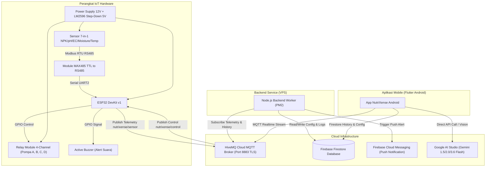

# 📘 Panduan Teknis (Technical Guidance) NutriXense
**Sistem Monitoring & Kontrol Nutrisi Tanaman Hydroponik/Pertanian Berbasis IoT, Cloud, dan AI (Gemini)**

---

## 📋 Daftar Isi
1. [Gambaran Umum & Arsitektur Sistem](#1-gambaran-umum--arsitektur-sistem)
2. [Skema Wiring & Rangkaian Perangkat IoT (ESP32)](#2-skema-wiring--rangkaian-perangkat-iot-esp32)
3. [Panduan Setup Cloud Services & API Key](#3-panduan-setup-cloud-services--api-key)
   - [3.1 Setup Firebase Console & Service Account](#31-setup-firebase-console--service-account)
   - [3.2 Setup HiveMQ Cloud MQTT Broker](#32-setup-hivemq-cloud-mqtt-broker)
   - [3.3 Setup Google AI Studio (Gemini API)](#33-setup-google-ai-studio-gemini-api)
4. [Deployment Backend Worker (Node.js & PM2)](#4-deployment-backend-worker-nodejs--pm2)
5. [Panduan Penggunaan Aplikasi Android NutriXense](#5-panduan-penggunaan-aplikasi-android-nutrixense)
6. [Panduan Penyusunan Buku Manual / Book PDF](#6-panduan-penyusunan-buku-manual--book-pdf)

---

## 1. Gambaran Umum & Arsitektur Sistem

NutriXense adalah sistem cerdas terintegrasi untuk memantau 7 parameter kualitas tanah/nutrisi tanaman (Nitrogen, Phosphorus, Potassium, pH, Kelembapan Tanah, Suhu Tanah, dan EC) secara real-time, mengontrol pompa pemupukan/penyiraman secara otomatis dan manual, serta memberikan diagnosa kesehatan tanaman berbasis Kecerdasan Buatan (Gemini AI).



---

## 2. Skema Wiring & Rangkaian Perangkat IoT (ESP32)

### 2.1 Daftar Komponen Hardware & Spesifikasi Tegangan

| No | Komponen | Fungsi | Tegangan Operasional | Signal / Komunikasi |
|---|---|---|---|---|
| 1 | **ESP32 DevKit v1** | Microcontroller utama (Wi-Fi + Bluetooth) | 5V DC (MicroUSB / VIN) | GPIO (3.3V Logic) |
| 2 | **Sensor 7-in-1 NPK Soil** | Mengukur N, P, K, pH, Kelembapan, Temp, EC | 12V DC | RS485 Modbus RTU |
| 3 | **Modul MAX485 (TTL to RS485)** | Converter Signal Serial UART ke RS485 | 5V DC | UART (TX2 / RX2 + Control DE/RE) |
| 4 | **Modul Relay 4-Channel** | Saklar otomatis untuk 4 Pompa DC/AC | 5V DC (Coil) | High/Low Trigger GPIO |
| 5 | **Active Buzzer 5V** | Peringatan suara lokal jika parameter abnormal | 5V DC | High/Low Trigger GPIO |
| 6 | **Pompa Air / Dosing (4 Unit)** | Pompa Nutrisi A, Nutrisi B, pH Adjuster, Utama | 12V DC | Daya Relay Switch |
| 7 | **Step-Down LM2596 DC-DC** | Menurunkan tegangan 12V ke 5V stabil | Input 12V -> Output 5V | Power Rail |
| 8 | **Power Supply Adapter 12V 5A** | Sumber daya utama seluruh rangkaian | 220V AC -> Output 12V DC | Power Input |

### 2.2 Tabel Pemetaan Pinout Wiring ESP32

```text
+-------------------------------------------------------------------------------+
|                               PINOUT MAPPING ESP32                            |
+----------------------+--------------------+-----------------------------------+
| Komponen Hardware    | Pin Perangkat      | Terhubung ke Pin ESP32 / Power    |
+----------------------+--------------------+-----------------------------------+
| MAX485 Converter     | VCC                | 5V DC (Output LM2596)             |
|                      | GND                | GND (Common Ground)               |
|                      | RO (Receiver Out)  | GPIO 16 (RX2)                     |
|                      | DI (Data In)       | GPIO 17 (TX2)                     |
|                      | DE & RE (Short)    | GPIO 4 (Direction Control)        |
|                      | A (RS485 Data +)   | Pin A Sensor 7-in-1               |
|                      | B (RS485 Data -)   | Pin B Sensor 7-in-1               |
+----------------------+--------------------+-----------------------------------+
| Sensor 7-in-1 NPK    | VCC (Kabel Merah)  | 12V DC (Positif Adapter 12V)      |
|                      | GND (Kabel Hitam)  | GND (Common Ground)               |
|                      | A (Kabel Kuning)   | Pin A MAX485                      |
|                      | B (Kabel Hijau)    | Pin B MAX485                      |
+----------------------+--------------------+-----------------------------------+
| Relay 4-Channel      | VCC                | 5V DC (Output LM2596)             |
|                      | GND                | GND (Common Ground)               |
|                      | IN 1 (Pompa A)     | GPIO 25                           |
|                      | IN 2 (Pompa B)     | GPIO 26                           |
|                      | IN 3 (Pompa pH)    | GPIO 27                           |
|                      | IN 4 (Pompa Utama) | GPIO 14                           |
+----------------------+--------------------+-----------------------------------+
| Active Buzzer        | VCC (+)            | GPIO 12                           |
|                      | GND (-)            | GND (Common Ground)               |
+----------------------+--------------------+-----------------------------------+
```

> [!IMPORTANT]
> **Common Grounding Rule**: Seluruh ground (GND LM2596, GND ESP32, GND MAX485, GND Relay, GND Sensor, GND Adapter 12V) **WAJIB dihubungkan bersama (Common GND)** agar sinyal komunikasi data Modbus RS485 dan Trigger Relay bekerja stabil tanpa noise.

---

## 3. Panduan Setup Cloud Services & API Key

### 3.1 Setup Firebase Console & Service Account

1. **Buat Project Firebase**:
   - Buka [Firebase Console](https://console.firebase.google.com/).
   - Klik **Add Project** -> Beri nama `nutrixense-app`.
2. **Registrasi Aplikasi Android**:
   - Klik ikon Android (`+ Add app`).
   - Masukkan Android Package Name: `com.example.nutrixense`.
   - Unduh file `google-services.json`.
   - Pindahkan file tersebut ke folder projek Flutter: `android/app/google-services.json`.
3. **Aktifkan Firestore Database**:
   - Masuk ke menu **Build -> Firestore Database -> Create Database**.
   - Pilih mode **Start in production mode** dan tentukan lokasi server (`asia-southeast1`).
   - Struktur Collection yang dipakai NutriXense:
     - `sensor_data`: Log riwayat sensor real-time & offline cache.
     - `automation_config/dss`: Ambang batas (min/max N, P, K, pH, Moisture, Temp, EC), durasi pulsa, dan `buzzerMuted`.
     - `watering_schedules`: Dokumentasi jadwal penyiraman otomatis.
     - `pump_activity_logs`: Catatan aktivitas eksekusi pompa (manual/otomatis).
     - `threshold_alert_logs`: Catatan peringatan saat sensor out-of-bounds.
4. **Generate Private Key untuk Backend Admin SDK**:
   - Buka **Project Settings -> Service Accounts**.
   - Klik **Generate new private key**.
   - Simpan file JSON hasil download ke folder backend dengan nama: `backend/serviceAccountKey.json`.

---

### 3.2 Setup HiveMQ Cloud MQTT Broker

1. **Buat Cluster HiveMQ Cloud**:
   - Login ke [HiveMQ Cloud Console](https://console.hivemq.cloud/).
   - Buat Cluster Server **Free Tier**.
   - Catat Cluster URL / Hostname Anda, contoh: `a8805b4f45744c3f9ac83882e423e0c0.s1.eu.hivemq.cloud`.
   - Port SSL/TLS yang digunakan: `8883`.
2. **Tambahkan Access Credentials (User & Password)**:
   - Masuk ke tab **Access Management**.
   - Buat Username baru (contoh: `hasyim`) dan Password (contoh: `hasyimHiveMQTT@22`).
3. **Skema Topic MQTT NutriXense**:

| Topic MQTT | Direction | Fungsi & Deskripsi Payload | Contoh Format Payload JSON |
|---|---|---|---|
| `nutrixense/sensor` | ESP32 -> App & Backend | Mengirim data telemetry sensor real-time (setiap 2-5 detik) | `{"N":45, "P":120, "K":300, "pH":6.2, "Moisture":65, "Temp":27.5, "EC":1.8}` |
| `nutrixense/control` | App/Backend -> ESP32 | Perintah kontrol relay pompa (manual override / otomatis) | `{"source":"manual_control", "manual_override":1, "relay1":1, "relay2":0, "relay3":0, "relay4":0}` |
| `nutrixense/status` | ESP32 -> App & Backend | Sinyal LWT (Last Will & Testament) status perangkat | `"online"` atau `"offline"` |
| `nutrixense/history` | ESP32 -> Backend | Batch sync data offline dari LittleFS saat koneksi terhubung | `{"N":45, ..., "timestamp":1722850000000}` |
| `nutrixense/config` | Backend -> ESP32 | Synchronize batas threshold & status buzzer muted (Retained) | `{"min_nitrogen":80, "max_nitrogen":180, ..., "buzzer_muted":{"nitrogen":true}}` |

---

### 3.3 Setup Google AI Studio (Gemini API)

1. **Dapatkan API Key Gemini**:
   - Buka [Google AI Studio](https://aistudio.google.com/).
   - Login dengan Akun Google Anda.
   - Klik **Get API Key** -> **Create API Key in new project**.
   - Salin string API Key yang dihasilkan (contoh: `AIzaSy...`).
2. **Konfigurasi API Key di Aplikasi Flutter NutriXense**:
   - **Metode A (Asset Config File - Disarankan untuk Development)**:
     Buka file `assets/config/gemini_config.json` (jika belum ada, buat dari `gemini_config.example.json`), lalu isi:
     ```json
     {
       "apiKey": "AIzaSy_YOUR_ACTUAL_GEMINI_API_KEY",
       "modelName": "gemini-1.5-flash"
     }
     ```
   - **Metode B (Dart Define - Disarankan untuk Production Build)**:
     Jalankan build dengan flag `dart-define`:
     ```bash
     flutter run --dart-define=GEMINI_API_KEY="AIzaSy_YOUR_ACTUAL_GEMINI_API_KEY"
     ```

---

## 4. Deployment Backend Worker (Node.js & PM2)

Backend Node.js bertugas menjalankan logika server 24 jam di VPS (Decision Support System rule-based, scheduler pompa, penyimpan data Firestore, dan pengirim FCM Push Notification).

### 4.1 Langkah Instalasi & Environment (.env)

1. Masuk ke folder backend:
   ```bash
   cd backend
   npm install
   ```
2. Salin `.env.example` menjadi `.env`:
   ```bash
   cp .env.example .env
   ```
3. Isi variabel di file `.env`:
   ```env
   MQTT_HOST=a8805b4f45744c3f9ac83882e423e0c0.s1.eu.hivemq.cloud
   MQTT_PORT=8883
   MQTT_USER=hasyim
   MQTT_PASS=hasyimHiveMQTT@22
   MQTT_TOPIC=nutrixense/sensor
   MQTT_HISTORY_TOPIC=nutrixense/history
   MQTT_CONFIG_TOPIC=nutrixense/config
   SAVE_INTERVAL_MS=60000
   SAVE_REALTIME_SENSOR_TO_FIRESTORE=false
   FIRESTORE_COLLECTION=sensor_data
   ```
4. Pastikan file `serviceAccountKey.json` dari Firebase sudah berada di folder `backend/serviceAccountKey.json`.

### 4.2 Menjalankan Process di VPS Menggunakan PM2

```bash
# Install PM2 secara global
npm install -g pm2

# Jalankan worker NutriXense
pm2 start src/index.js --name nutrixense-backend

# Simpan proses agar otomatis berjalan saat VPS reboot
pm2 save
pm2 startup
```

---

## 5. Panduan Penggunaan Aplikasi Android NutriXense

### 5.1 Penjelasan Layar Utama (Screens)

1. **Dashboard Home**:
   - **Kartu Sensor Real-Time**: Menampilkan 6+1 parameter utama (Nitrogen, Phosphorus, Potassium, pH, Kelembapan Tanah, Suhu Tanah, EC) lengkap dengan indikator warna status (**Normal (Hijau)**, **Low (Merah)**, **High (Oranye)**).
   - **Status Koneksi**: Badge indikator status koneksi MQTT HiveMQ dan status online/offline hardware ESP32.
   - **Grafik Tren Real-Time**: Visualisasi pergerakan grafik NPK secara live.
2. **Riwayat & Grafik (History)**:
   - Filter rentang waktu: **Hari Ini**, **7 Hari**, dan **30 Hari**.
   - Tab pemilih sensor untuk melihat kurva tren detail (N, P, K, pH, Moisture, Temp, EC).
   - Statistik ringkasan: Nilai Minimum, Maksimum, dan Rata-rata.
   - Tabel log data lengkap dan opsi ekspor riwayat.
3. **AI Plant Scan (Scan Kesehatan Tanaman)**:
   - Fitur viewfinder kamera interaktif dengan efek animasi pemindaian AI.
   - Analisis visual daun/tanaman menggunakan Gemini AI Vision untuk mengidentifikasi gejala penyakit, klorosis (kekurangan N/Fe), atau kelebihan nutrisi.
   - Hasil diagnosa komprehensif beserta tingkat keparahan dan rekomendasi penanganan.
4. **NutriAI Insights (Rekomendasi Cerdas)**:
   - Diagnosa otomatis kondisi tanaman berbasis korelasi multi-sensor dan AI.
   - Rekomendasi takaran pupuk dan penyesuaian pH (turun/naik) yang disesuaikan dengan profil media tanam & jenis tanaman.
   - Modal Pengaturan Ambang Batas (Threshold Config) untuk mengubah batas min/max sensor.
5. **Kontrol Pompa (Control Screen)**:
   - Toggle manual saklar 4 Pompa (Pompa Nutrisi A, Pompa Nutrisi B, Pompa pH Adjuster, Pompa Penyiraman Utama).
   - Mode operasi: Manual Override vs Mode Otomatis (DSS Rule-Based).
   - Penjadwalan Penyiraman Otomatis (Auto-Schedule Display & Editor) dengan timer hitung mundur durasi aktif pompa.
6. **Logs & Alerts (Pusat Log Peringatan)**:
   - Riwayat notifikasi peringatan parameter abnormal (Threshold Alerts).
   - Pengaturan mute buzzer per sensor (`buzzerMuted` toggle) jika pengguna ingin menonaktifkan alarm suara untuk sensor tertentu tanpa mematikan monitoring.
   - Catatan log eksekusi saklar pompa (siapa/kapan pompa dihidupkan).

---

## 6. Panduan Penyusunan Buku Manual / Book PDF

Jika panduan ini akan dipublikasikan atau ditaruh sebagai **Buku Panduan Teknis (Technical Manual / Book PDF)** untuk Tugas Akhir, Laporan Produk, atau User Guide, ikuti struktur penyusunan bab dan panduan tata letak berikut:

### 6.1 Struktur Bab & Isi Buku PDF

```text
KAVER BUKU (Judul, Logo, Nama Peneliti/Pengembang, Institusi)
KATA PENGANTAR & DAFTAR ISI

BAB I: PENDAHULUAN & ARSITEKTUR SISTEM
  1.1 Latar Belakang & Tujuan NutriXense
  1.2 Arsitektur Sistem End-to-End (IoT - Cloud - AI - Mobile)
  1.3 Spesifikasi Parameter Nutrisi (NPK, pH, Moisture, Temp, EC)

BAB II: PERANGKAT HARDWARE IOT & SKEMA WIRING
  2.1 Daftar Komponen Hardware & Konsumsi Daya
  2.2 Pemetaan Pinout ESP32 & Modul RS485 MAX485
  2.3 Skema Rangkaian Schematics Wiring (Diagram Rangkaian & Common GND)
  2.4 Tata Cara Assembly & Testing Komponen Hardware

BAB III: KONFIGURASI CLOUD SERVICES & API KEYS
  3.1 Setup Firebase Console & Service Account
  3.2 Setup HiveMQ Cloud Broker MQTT & SSL/TLS
  3.3 Setup Google AI Studio & Pengintegrasian Gemini API

BAB IV: DEPLOYMENT BACKEND WORKER (VPS NODE.JS)
  4.1 Persiapan Environment & Variabel Rahasia (.env)
  4.2 Manajemen Proses Service dengan PM2
  4.3 Arsitektur Pengiriman FCM Push Notification & Synchronizer Config

BAB V: PANDUAN PENGGUNAAN APLIKASI MOBILE ANDROID
  5.1 Instalasi & Persyaratan Perangkat Android
  5.2 Panduan Penggunaan Dashboard Monitoring Real-Time
  5.3 Panduan Analisis Riwayat & Ekspor Data (History)
  5.4 Panduan Fitur AI Plant Scan (Kamera & Diagnosis Penyakit)
  5.5 Panduan NutriAI Insights & Pengaturan Ambang Batas (Threshold)
  5.6 Panduan Pengoperasian Pompa Manual & Penjadwalan Otomatis

BAB VI: PEMELIHARAAN SISTEM & TROUBLESHOOTING
  6.1 Prosedur Kalibrasi Sensor NPK / pH / EC
  6.2 Diagnosa Masalah Koneksi MQTT / Wi-Fi ESP32
  6.3 Solusi Masalah Kegagalan Response Gemini API Key
  6.4 Panduan Perawatan Pompa & Modul Relay

DAFTAR PUSTAKA & LAMPIRAN
  Lampiran 1: Data Sheet Komponen
  Lampiran 2: Kode Firmware ESP32 & Payload JSON Reference
```

### 6.2 Panduan Format Layout & Tipografi Buku PDF

1. **Ukuran Halaman & Margin**:
   - Ukuran Kertas: **A4 (210 x 297 mm)** atau **B5 (176 x 250 mm)**.
   - Margin: Left = 3 cm (untuk jilid), Right = 2 cm, Top = 2.5 cm, Bottom = 2.5 cm.
2. **Tipografi & Skema Warna**:
   - Primary Font: **Inter**, **Roboto**, atau **Segoe UI** (Gunakan ukuran 11pt untuk isi, line height 1.3 - 1.5).
   - Judul Bab (Heading 1): 18pt Bold (Warna Hijau NutriXense `#2E7D52`).
   - Sub Bab (Heading 2): 14pt Semi-Bold.
3. **Penggunaan Visual & Element Callout**:
   - **Tabel Wiring**: Berikan border tipis berwarna abu-abu dengan header berwarna hijau tua `#2E7D52` dan teks putih.
   - **Callout Box**: Gunakan kotak berlatar belakang warna lembut untuk catatan penting:
     - 💡 *Tips*: Kotak Hijau Muda
     - ⚠️ *Peringatan/Penting*: Kotak Oranye / Merah Muda (misal: aturan Common GND).
   - **Tampilan Tangkapan Layar (Screenshots)**: Berikan border 1px shadow pada screenshot aplikasi Android dan berikan caption di bawah gambar (contoh: *Gambar 5.1: Tampilan Dashboard Home Real-Time*).

---
*NutriXense Technical Guidance · Dokumen Resmi Sistem Monitoring Nutrisi Tanaman IoT & AI*
